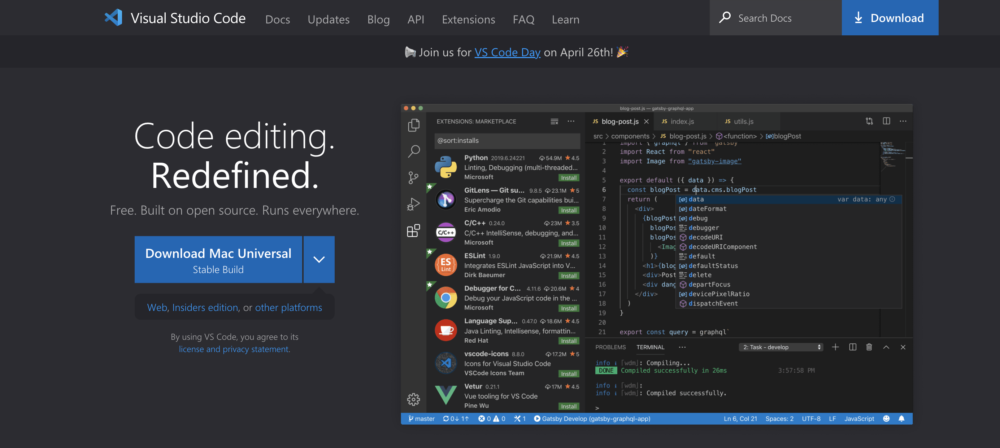
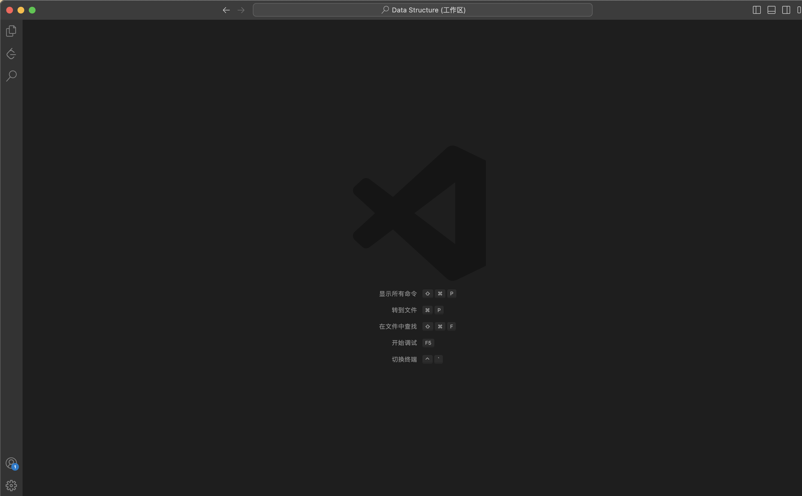

# How to log into a CSE15L account on ieng6?
This page serves as an instruction on how to log into UCSD CSE15L account

Look up your account here **<https://sdacs.ucsd.edu/~icc/index.php>**

## Step One : Installing Visual Studio Code
1. Click on the following link **<https://code.visualstudio.com/>**

Download the corresponding version of Visual Studio Code for your operation system.

2. When you finished downloading, open Visual Studio Code and you should see a layout like this


## Step Two : Remotely Connecting To Your CSE15L Account
Many courses in CSE use course-specific accounts. These are similar to accounts you might get on other systems at other institutions (or a future job). We’ll see how to use VScode/terminal to connect to a remote computer over the Internet to do work there.

1. For Windows Users :
    - Install [Git for Windows](https://gitforwindows.org/)
    - Once installed, use the steps [In this post](https://stackoverflow.com/questions/42606837/how-do-i-use-bash-on-windows-from-the-visual-studio-code-integrated-terminal/50527994#50527994) to set up the default terminal to use the newly-in-stalled `Git bash` in Visual Studio Code

2. For Mac Users :
    - Open a terminal in VScode (Ctrl or Command + \`, or use the Terminal → New Terminal menu option)
    - Your command will look like this `ssh cs15lsp23zz@ieng6.ucsd.edu` but with the `zz` replaced by the letters in your course- specific account.
    - Then you will get the first-time connect message 
        ```
        ⤇ ssh cs15lsp23zz@ieng6.ucsd.edu
        The authenticity of host 'ieng6.ucsd.edu (128.54.70.227)' can't be established.
        RSA key fingerprint is SHA256:ksruYwhnYH+sySHnHAtLUHngrPEyZTDl/1x99wUQcec.
        Are you sure you want to continue connecting (yes/no/[fingerprint])? 
        ```
        Type yes and press enter, then type in your password. **Attention : when typing your password, your terminal will look like this **
3. Connect to your remote computer using terminal
    - Open

## Step Three : Trying Some Commands : 
