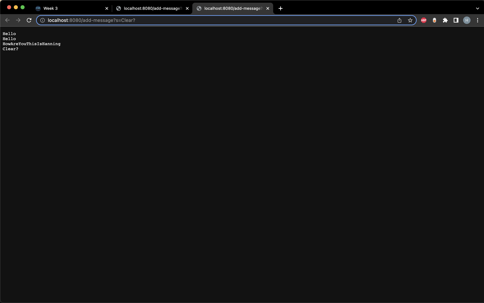

# Lab Report Two
This page is the Lab Report2


## Part One
The following is the code block of a web server called `StringServer` that supports the path and behavior described in the write-up :
```
import java.io.IOException;
import java.net.URI;

class Handler implements URLHandler {
    // The one bit of state on the server: a string that will be manipulated by
    // various requests.
    StringBuilder message = new StringBuilder();

    public String handleRequest(URI url) {
        if (url.getPath().equals("/add-message")) {
            String query = url.getQuery();
            if (query == null) {
                return "400 Bad Request: Missing message parameter!";
            }
            String[] parameters = query.split("=");
            if (parameters[0].equals("s")) {
                String newMessage = parameters[1];
                message.append(newMessage).append("\n");
                return message.toString();
            } else {
                return "400 Bad Request: Invalid parameter!";
            }
        } else {
            return "404 Not Found!";
        }
    }
}

class StringServer {
    public static void main(String[] args) throws IOException {
        if(args.length == 0){
            System.out.println("Missing port number! Try any number between 1024 to 49151");
            return;
        }

        int port = Integer.parseInt(args[0]);

        Server.start(port, new Handler());
    }
}
```

The following are two screenshots of using `/add-message`



Both screenshots use method `.getPath()`, `.getQuery()`, `.split()`, `.append()` and `.toString()` to build the result.
The relevant field of the class is StringBuilder `message`, and `message` is changing with the input parameters, when the size of parameters increase, StringBuilder `message` will append the `newMessage` to the end of the StringBuilder.
    

## Part Two
The bug I chose is the bugs from ListExamples.java
  1. A failure-inducing input would be when 2 or more input arrays when the `StringChecker` check for length greater than 2, for example :
```
@Test
public void testFilter() {
    List<String> input = Arrays.asList("This", "Is", "Hanning", "Yue");
    StringChecker sc = s -> s.length() > 2; // Keep only strings with length > 2
    List<String> result = ListExamples.filter(input, sc);
    List<String> expected = Arrays.asList("This", "Hanning", "Yue");

    assertEquals(expected, result);
}
Expect [This, Hanning, Yue]
Produce [Yue, Hanning, This]
```
In this case, the `filter()` method could not return the result in a ordered manner. 
  
  2. An input that doesn't induce a failure would be in the case when the StringChecker check for the length equals to 0, for example :
```
@Test
public void testFilterThree() {
    List<String> input = Arrays.asList();
    StringChecker sc = s -> s.length() == 0; // Keep only strings with length == 0
    List<String> result = ListExamples.filter(input, sc);
    List<String> expected = Arrays.asList();

    assertEquals(expected, result);
}
Expect []
Produce []
```
  3. The symptom


  4. I fixed the bug and commented on the place


Delete the index parameter can make the added element shift in order automatically.


Typo Error

## Part Three
The most important thing I learned from Lab2 and Lab3 is the navigation of GitHub, the use of Git command the an introduction to GitHub desktop. I think learning to use GitHub is crucial helping me understand other people's GitHub repositories and gather the useful learning resources online.
